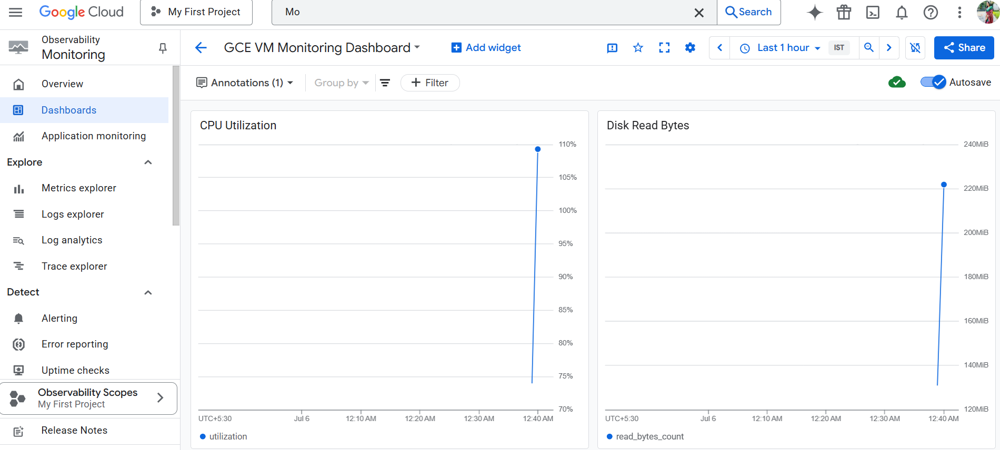

# 📊 Stackdriver Monitoring Dashboard

A GCP-native monitoring solution to visualize metrics like CPU utilization, disk activity, and network I/O for Compute Engine (GCE) VMs using Stackdriver Monitoring.

## 🚀 Features

- Google Cloud Monitoring (Stackdriver) integration
- Custom dashboard for real-time GCE metrics
- CPU, disk, and network monitoring
- Uses JSON config to create dashboards via `gcloud`

## 🛠️ Setup Instructions

1. Enable required APIs:
    ```bash
    gcloud services enable monitoring.googleapis.com
    ```

2. Deploy the dashboard from `dashboard.json`:
    ```bash
    gcloud monitoring dashboards create --config-from-file=dashboards/dashboard.json
    ```

3. Create a test VM and generate load:
    ```bash
    gcloud compute instances create monitoring-vm --zone=us-central1-a
    gcloud compute ssh monitoring-vm --zone=us-central1-a
    sudo apt-get install stress -y
    stress --cpu 1 --timeout 120
    ```

4. View dashboard:
    [Monitoring Dashboards](https://console.cloud.google.com/monitoring/dashboards)

---

## 📷 Screenshot



---

## 🧠 Purpose

This project demonstrates infrastructure observability in GCP using Stackdriver Monitoring. It’s useful for real-time performance monitoring of cloud instances, and aligns with SRE and DevOps best practices.

---

## 📦 Tech Stack

- Google Cloud Monitoring (Stackdriver)
- GCE VM (Compute Engine)
- Bash + gcloud CLI

---

## 🪪 License

[MIT License](LICENSE)

---

## 👩‍💻 Author

**Kshitija Randive**  

🔗 GitHub | 🌐 Portfolio
